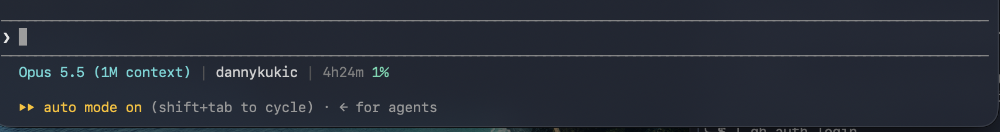

# Claude Code status line

A compact status line for [Claude Code](https://claude.com/claude-code), for Windows (PowerShell) and macOS/Linux (bash).



## What it shows

`model | folder | git branch | 5h rate-limit usage | context usage | team`

- The 5h label becomes a countdown to the window reset (e.g. `2h14m 37%`), falling back to `5h`.
- Percentages: turquoise < 60%, yellow ≥ 60%, orange ≥ 80%, bold red ≥ 90%.
- Separators are dark grey ` | `; colours are 256-colour codes; `NO_COLOR` disables colour.
- Team is your Claude organization name, read from `oauthAccount.organizationName` in `~/.claude.json` (it isn't in the status line JSON). It's dropped when logged out or using an API key.
- Segments with no data (e.g. no git repo, no rate-limit info yet) are dropped.
- Prints a second line containing only U+200B (zero width space) as a spacer row.

## Install

### macOS / Linux (bash)

Requires `jq` (preinstalled on recent macOS; otherwise `brew install jq`).

```sh
curl -fsSL https://raw.githubusercontent.com/DannyKuk/claude-statusline/main/statusline.sh -o ~/.claude/statusline.sh
chmod +x ~/.claude/statusline.sh
```

Or copy `statusline.sh` from a clone of this repo. Then add to `~/.claude/settings.json`:

```json
"statusLine": {
  "type": "command",
  "command": "~/.claude/statusline.sh",
  "refreshInterval": 60
}
```

### Windows (PowerShell)

Copy `statusline.ps1` to `%USERPROFILE%\.claude\statusline.ps1`, then add to `%USERPROFILE%\.claude\settings.json`:

```json
"statusLine": {
  "type": "command",
  "command": "powershell.exe -NoProfile -File \"C:\\Users\\<you>\\.claude\\statusline.ps1\"",
  "refreshInterval": 60
}
```

Restart Claude Code if the status line doesn't appear.

## Testing

Pipe sample JSON into the script:

```sh
echo '{"model":{"display_name":"Opus"},"workspace":{"current_dir":"'"$PWD"'"},"context_window":{"used_percentage":42}}' | ~/.claude/statusline.sh
```

`STATUSLINE_CLOCK_OVERRIDE=<unix seconds>` pins the clock for countdown testing.
