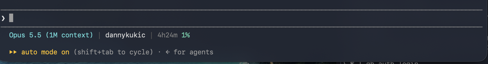

# Claude Code status line

A compact status line for [Claude Code](https://claude.com/claude-code), for Windows (PowerShell) and macOS/Linux (bash).



## What it shows

`model | folder | git branch | 5h rate-limit usage | context usage | team | energy`

- The 5h label becomes a countdown to the window reset (e.g. `2h14m 37%`), falling back to `5h`.
- Percentages: turquoise < 60%, yellow ≥ 60%, orange ≥ 80%, bold red ≥ 90%.
- Separators are dark grey ` | `; colours are 256-colour codes; `NO_COLOR` disables colour.
- Team is your Claude organization name on Team/Enterprise plans, and `Personal` on personal plans (Pro, Max, ...), whose orgs are auto-named `<email>'s Organization`. It's read from `oauthAccount.organizationName` / `organizationType` in `~/.claude.json` (it isn't in the status line JSON), and dropped when logged out or using an API key.
- Energy is a rough estimate of the session's electricity use, e.g. `⚡ ~12 Wh est. (≈0.8 🔋)`, where 🔋 is a ~15 Wh smartphone charge. It is not a measurement: Anthropic publishes no energy figures, so it applies public per-token estimates (Google/OpenAI disclosures, Epoch AI, TokenPowerBench) to the token counts in the session transcript, subagents included, scaled down for smaller models. Treat it as an order of magnitude. It's cached in the temp directory by transcript size, so idle refreshes don't re-parse the session.
- Segments with no data (e.g. no git repo, no rate-limit info yet) are dropped.
- Prints a second line containing only U+200B (zero width space) as a spacer row.

## Settings

To turn segments off, list them under `hide` in `~/.claude/statusline.json` (`%USERPROFILE%\.claude\statusline.json` on Windows):

```json
{ "hide": ["energy", "team"] }
```

Segment names: `model`, `folder`, `branch`, `5h`, `ctx`, `team`, `energy`. Hidden segments aren't computed at all, so hiding `energy` also skips reading the transcript. Without the file, or if it isn't valid JSON, everything is shown. Changes apply on the next refresh. `STATUSLINE_CONFIG=<path>` reads a different file.

## Install

### macOS / Linux (bash)

Requires `jq` (preinstalled on recent macOS; otherwise `brew install jq`).

```sh
curl -fsSL https://raw.githubusercontent.com/DannyKuk/claude-statusline/main/statusline.sh -o ~/.claude/statusline.sh
chmod +x ~/.claude/statusline.sh
```

Or copy `statusline.sh` from a clone of this repo. Then add to `~/.claude/settings.json`:

```json
"statusLine": {
  "type": "command",
  "command": "~/.claude/statusline.sh",
  "refreshInterval": 60
}
```

### Windows (PowerShell)

Copy `statusline.ps1` to `%USERPROFILE%\.claude\statusline.ps1`, then add to `%USERPROFILE%\.claude\settings.json`:

```json
"statusLine": {
  "type": "command",
  "command": "powershell.exe -NoProfile -File \"C:\\Users\\<you>\\.claude\\statusline.ps1\"",
  "refreshInterval": 60
}
```

Restart Claude Code if the status line doesn't appear.

## Testing

Pipe sample JSON into the script:

```sh
echo '{"model":{"display_name":"Opus"},"workspace":{"current_dir":"'"$PWD"'"},"context_window":{"used_percentage":42}}' | ~/.claude/statusline.sh
```

`STATUSLINE_CLOCK_OVERRIDE=<unix seconds>` pins the clock for countdown testing.
